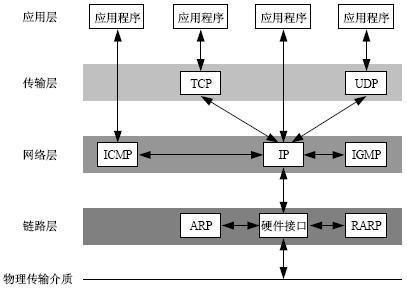

# OSI 7层模型和 TCP/IP 4层模型

## Catalog
1. OSI 7 层模型
    + 1.1 OSI 模式是什么?
        - 1.1.1 层次划分
        - 1.1.2 影响
    + 1.2 OSI 模型各层的基本作用
2. TCP/IP 互联网协议套件 (Internet Protocol Suite, 缩写 IPS)
    + 2.1 TCP/IP 四层概念模型

## New Words
- **presentation [prez(ə)n'teɪʃ(ə)n] --n.介绍, 赠送, 展示, 描述**
    + How much time have I got for the presentation? 我可以有多少时间作陈述？
    + Presentation mode 演示模式
    + We'll each make our presentation. Let them decide. 我们各自做个介绍, 让他们来决定. 

## Content

### 1. OSI 7 层模型

#### 1.1 OSI 模式是什么?
- `OSI`(open system interconnection 开放式系统互联参考模型, 简称为 `OIS 模型`)
  是一种概念模型, 由国际标准化组织提出,
  一个试图使各种计算机在世界范围内互联为网络的标准框架. 定义于 ISO/IEC 7498-1.

  在制定计算机网络标准方面, 起着重大作用的两大国际组织是: 国际电信联盟电信标准化部门,
  与国际标准组织(ISO), 虽然它们工作领域不同, 但随着科学技术的发展,
  通信与信息处理之间的界限开始变得比较模糊,
  这也成了国际电信联盟电信标准化部门和 ISO 共同关心的领域. 1984年,
  ISO 发布了著名的 ISO/IEC 7498 标准, 它定义了**网络互联的7层框架,
  也就是开放式系统互联参考模型(OSI)**.
##### 1.1.1 层次划分
  根据建议 X.200, OSI 将计算机网络体系结构划分为以下 7 层, 标有 1～7, 
  第 1 层在底部. 现 "OSI/RM" 是英文 "Open Systems Interconnection Reference
Model" 的缩写.
- **第 7 层: 应用层**
    + `应用层(Application Layer)` 提供为应用软件而设的接口,
      以设置与另一应用软件之间的通信. 例如: HTTP, HTTPS, FTP, Telnet, SSH,
      SMTP, POP3 等.
- **第 6 层: 表达层**
    + `表达层(Presentation Layer)`:
      把数据转换为能与接收者的系统格式兼容并适合传输的格式.
- **第 5 层: 会话层**
  
    + `会话层(Session Layer)`: 负责在数据传输中设置和维护计算机网络中两台计算机之间的通信连接. 
- **第 4 层: 传输层**
    + `传输层(Transport Layer)`: 把传输表头(TH)加至数据以形成数据包.
      传输表头包含了所使用的协议等发送信息. 例如: 传输控制协议(TCP)等. 
- **第 3 层: 网络层**
    + `网络层(Network Layer)`: 决定数据的路径选择和转寄, 将网络表头(NH)加至数据包,
      以形成报文. 网络表头包含了网络数据. 例如:互联网协议(IP)等. 
- **第 2 层: 数据链路层**
    + `数据链路层(Data Link Layer)`: 负责网络寻址、错误侦测和改错. 
      当表头和表尾被加至数据包时, 会形成信息框(Data Frame).
      数据链表头(DLH) 是包含了物理地址和错误侦测及改错的方法.
      数据链表尾(DLT)是一串指示数据包末端的字符串. 例如: 以太网,
      无线局域网(Wi-Fi)和通用分组无线服务(GPRS)等. 
      
      它分为两个子层: 
        - (1) 逻辑链路控制(logical link control, LLC)子层
        - (2) 介质访问控制(Media access control, MAC)子层. 
- **第 1 层: 物理层**
  
    + `物理层(Physical Layer)`: 在局部局域网上传送数据帧(Data Frame), 它负责管理电脑通信设备和网络媒体之间的互通. 包括了针脚、电压、线缆规范、集线器、中继器、网卡、主机接口卡等. 
##### 1.1.2 影响
- OSI 是一个定义良好的协议规范集, 并有许多可选部分完成类似的任务.
  它定义了开放系统的层次结构、层次之间的相互关系以及各层所包括的可能的任务,
  作为一个框架来协调和组织各层所提供的服务. 

  OSI 参考模型并没有提供一个可以实现的方法, 而是描述了一些概念,
  用来协调进程间通信标准的制定. 即 OSI 参考模型并不是一个标准,
  而是一个在制定标准时所使用的概念性框架. 

<table class="model">
    <tbody>
    <tr>
        <th>OSI 七层网络模型</th>
        <th>TCP/IP 四层概念模型</th>
        <th>对应网络协议</th>
    </tr>
    <tr>
        <td>(7) 应用层 (Application)</td>
        <td rowspan="3">应用层</td>
        <td>HTTP, TFTP, FTP, NFS, WAIS, SMTP</td>
    </tr>
    <tr>
        <td>(6) 表示层 (Presentation)</td>
        <td>Telnet, Rlogin, SNMP, Gopher</td>
    </tr>
    <tr>
        <td>(5) 会话层 (Transport)</td>
        <td>SMTP, DNS</td>
    </tr>
    <tr>
        <td>(4) 传输层 (Transport)</td>
        <td>传输层</td>
        <td>TCP, UDP</td>
    </tr>
    <tr>
        <td>(3) 网络层 (Network) </td>
        <td>网络层</td>
        <td>IP, ICMP, ARP, RARP, AKP, UUCP</td>
    </tr>
    <tr>
        <td>(2) 数据链路层 (Data Link)</td>
        <td rowspan="2">数据链路层</td>
        <td>FDDI, Ethernet, Arpanet, PDN, SLIP, PPP</td>
    </tr>
    <tr>
        <td>(1) 物理层 (Physical)</td>
        <td>IEEE 802.1A, IEEE 802.2 到 IEEE 802.11</td>
    </tr>
    </tbody>
</table>

#### 1.2 OSI 模型各层的基本作用
- (7) 应用层 (Application) -- 为应用程序提供网络服务
    + (7.1) 作用: 
        + (7.1.1) 规定应用程序的数据格式
        + (7.1.2) 如 ftp, 网页, smtp 的数据格式.
    + (7.2) 是对 OSI 模型中最高 3 层的合并, 直接面向用户.
- (6) 表示层 (Presentation) -- 数据格式化, 加密, 解密.
- (5) 会话层 (Transport) -- 建立, 维护, 管理会话连接
- (4) 传输层 (Transport) -- 建立, 维护, 管理端到端连接.
  主要解决数据如何在网络中传输: 有 TCP/UDP 两种传输形式.
    + (4.1) 作用
        - (4.1.1) 建立 端口 - 端口 间的连接 
    + (4.2) 端口 port
        - (4.2.1) 取值: 0 - 65535 
            + (1) 0 - 1023 系统占用
            + (2) 应用程序随机选取.
            + (3) http 80 端口
            + (4) 代理服务器 8080 端口.
        - (4.2.2) 指定 IP 包具体给哪个进程; 另外, 一个进程可能与很多计算机连接,
          会有多个端口.
    + (4.3) Socket (套接字, 使应用程序能够读写与收发通讯协定(protocol)
      与资料的程序)
        - (4.3.1) 进程间通信: 需要双方 IP, 端口号(port), 通信采用的协议栈
        - (4.3.2) 格式: 无符号整型变量, 用啦表示一个通信进程
        - (4.3.3) 本质: 是编程接口 API, 对 TCP/IP 协议的封装
    + (4.4) TCP/UDP:
        - (4.4.1) 作用: 在数据包标头加上端口号
        - (4.4.2) TCP: 复杂, 稳定, 有包遗失会重发.
        - (4.4.3) UDP: 简单, 但不稳定, 不能确定双方是否成功接收.
- (3) 网络层 (Network) -- IP 寻址和路由选择.
    + (3.1) 作用:
        - (3.1.1) 建立主机 - 主机之间的连接
    + (3.2) 引入新的地址模式 - IP 地址/网络地址, 可以区分哪些 PC 是同一子网(局域网)内.
    + (3.3) IP 类型分类
    + (3.4) 子网掩码(subnet mask)
    + (3.5) 路由(routing)
    + (3.6) ARP 协议
        - (3.6.1) 作用: 局域网 IP 和 MAC 地址的对应关系.
        - (3.6.2) 作用位置: 介于数据链路层和网络层之间
        - (3.6.3) 局限: 仅限于 IPv4, IPv6 用 Neighbor Discovery Protocol 替代.
- (2) 数据链路层 (Data Link) -- 控制网络层与物理层之间通信.
    + (2.1) 作用:
        - (2.1.1) 根据以太网协议将一组电信号组成一个数据包, 称作 "帧",
          并控制它的传输. 有 2 部分:
            + (1) 标头 head: 标明数据发送者, 接收者, 数据类型
            + (2) 数据 data.
    + (2.2) ☆ MAC 地址
        - (2.2.1) 作用: 定位数据包的路径, 如发送者, 接收者.
        - (2.2.2) 即网卡地址, 每个网卡都是独一无二的 12 个 16 进制数.
        - (2.2.3) 前 6 个表示厂商, 后 6 个表示流水号.
    + (2.3) 广播方式
        - (2.3.1) 发送者把数据包, 发送给局域网内的所有 PC, 让每个 PC 根据 MAC
          地址自动匹配.
        - (2.3.2) 发送媒介: 分组交换机 / 网络交换机.
    + (2.4) 网络交换机(network switch)
        - (2.4.1) 扩展网络的机器 
        - (2.4.2) 作用: 为子网提供更多的接口, 以连接更多的 PC
- (1) 物理层 (Physical) -- 比特流(bit)传输.
  
  (Hint: 内存的最小单位: 位(bit[bɪt] 比特), 将 8 个位组合为一组,
  称为字节(byte[baɪt])[1byte(字节) = 8bit(比特)]. 每个字节都有唯一的地址.
  字节地址从 0 开始, 第一位只能是 0 或 1.)
    + (1.1) 通过光缆, 电缆, 无线电波等方式将设备连接起来组网.
    + (1.2) 两个不同局域网(移动, 电信)通信, 需要 ISP 互联网服务供应商的物理连接.
    + (1.3) 作用: 传送比特流 0 和 1.    

### 2. TCP/IP 互联网协议套件 (Internet Protocol Suite, 缩写 IPS)
- **互联网协议套件**(英语：Internet Protocol Suite, 缩写 IPS)
  [[1\]](https://zh.wikipedia.org/wiki/TCP/IP协议族#cite_note-1)
  是一个网络通信模型, 以及一整个
  [网络传输协议](https://zh.wikipedia.org/wiki/网络传输协议) 家族,
  为 [网际网络](https://zh.wikipedia.org/wiki/网际网络) 的基础通信架构.
  它常被通称为**TCP/IP协议族**(英语：TCP/IP Protocol Suite, 或TCP/IP Protocols), 简称**TCP/IP**
  [[2\]](https://zh.wikipedia.org/wiki/TCP/IP协议族#cite_note-2). 因为该协议家族的两个核心协议:
  **TCP([传输控制协议](https://zh.wikipedia.org/wiki/传输控制协议))**
  和 **IP([网际协议](https://zh.wikipedia.org/wiki/网际协议))**,
  为该家族中最早通过的标准[[3\]](https://zh.wikipedia.org/wiki/TCP/IP协议族#cite_note-3). 
  由于在网络通讯协议普遍采用分层的结构, 当多个层次的协议共同工作时,
  类似计算机科学中的[堆栈](https://zh.wikipedia.org/wiki/堆栈),
  因此又被称为**TCP/IP 协议栈**
  (英语：TCP/IP Protocol Stack)[[4\]](https://zh.wikipedia.org/wiki/TCP/IP协议族#cite_note-4)[[5\]](https://zh.wikipedia.org/wiki/TCP/IP协议族#cite_note-5). 这些协议最早发源于
  [美国国防部](https://zh.wikipedia.org/wiki/美国国防部)
  (缩写为 DoD)的
  [ARPA网](https://zh.wikipedia.org/wiki/ARPA网) 项目,
  因此也被称作**DoD 模型**(DoD Model)[[6\]](https://zh.wikipedia.org/wiki/TCP/IP协议族#cite_note-6).
  这个协议族由[互联网工程任务组](https://zh.wikipedia.org/wiki/互联网工程任务组)负责维护. 

  TCP/IP 提供了点对点链接的机制, 将数据应该如何封装、定址、传输、路由以及在目的地如何接收, 都加以标准化. 它将软件通信过程[抽象化](https://zh.wikipedia.org/wiki/抽象化_(計算機科學))为四个[抽象层](https://zh.wikipedia.org/wiki/抽象層), 采取[协议堆栈](https://zh.wikipedia.org/w/index.php?title=協定堆疊&action=edit&redlink=1)的方式, 分别实现出不同通信协议. 协议族下的各种协议, 依其功能不同, 被分别归属到这四个层次结构之中[[7\]](https://zh.wikipedia.org/wiki/TCP/IP协议族#cite_note-7)[[8\]](https://zh.wikipedia.org/wiki/TCP/IP协议族#cite_note-8), 常被视为是简化的七层[OSI模型](https://zh.wikipedia.org/wiki/OSI模型). 
- Wiki 笔记, 未做完:
  https://zh.wikipedia.org/wiki/TCP/IP%E5%8D%8F%E8%AE%AE%E6%97%8F
  有时间接着写......

#### 2.1 TCP/IP 四层概念模型
- 2、TCP/IP 协议是指因特网整个 TCP/IP 协议族. 不同于 ISO 模型的 7 个分层, TCP/IP 协议参
    考模型把所有的 TCP/IP 系列协议归类到四个抽象层中:
    + 应用层: TFTP, HTTP, SNMP, FTP, SMTP, DNS, Telent等等
    + 传输层: TCP, UDP
    + 网络层: IP, ICMP, OSPF, EIGERP, IGMP
    + 数据链路层: SLIP, CSLIP, PPP, MTU
    
  每一抽象层建立在低一层提供的服务上, 并且为高一层提供服务. 
  
  
  
  TCP/IP协议分层和ISO模型的7个分层对比
  
  

- 3.什么是socket? [参考文章](http://www.cnblogs.com/dolphinX/p/3460545.html)
    + 我们知道两个进程如果需要进行通讯最基本的一个前提是能够唯一的标识一个进程, 在本地进程通讯
      中我们可以使用 PID 来唯一标识一个进程, 但 PID 只在本地唯一, 网络中的两个进程 PID 冲突
      几率很大, 这时候我们需要另辟它径, 我们知道 IP 层的 ip 地址可以唯一标识主机, 而 
      TCP 层协议和端口号可以唯一标识主机的一个进程, 这样我们就可以利用 
      ip 地址 + 协议 + 端口号 唯一标识网络中的一个进程. 
    + 能够唯一标识网络中的进程后, 他们就可以利用 socket 进行通信了, 什么是 socket? 
        - 我们经常把 socket 翻译为套接字, socket 是在应用层和传输层之间的一个抽象层, 
          它把 TCP/IP 层复杂的操作抽象为几个简单的接口供应用层调用来实现进程在网络中通信. 
          socket 起源于 UNIX, 在 Unix 一切皆文件哲学的思想下, socket 是一种 
          "打开-读/写-关闭" 模式的实现, 服务器和客户端各自维护一个文件, 在建立连接打开后, 
          可以向自己文件写入内容供对象读取或者读取对方内容, 通讯结束时关闭文件. 
            
   
- PID: 在计算机领域, 进程标识符(英文: process identifier 又略称 进程ID 
  (英文: process ID)、PID)是大多数操作系统的内核用于唯一标识"进程"的一个数值. 这一数值可以
  作为许多函数调用的参数, 以使调整进程优先级, 杀死进程之类的进程控制行为成为可能. 
  [wiki/进程ID](https://zh.wikipedia.org/wiki/%E8%BF%9B%E7%A8%8BID)
  
- syn包 (同步序列编号: Synchronize Sequence Numbers)
  
   
  
   
  
