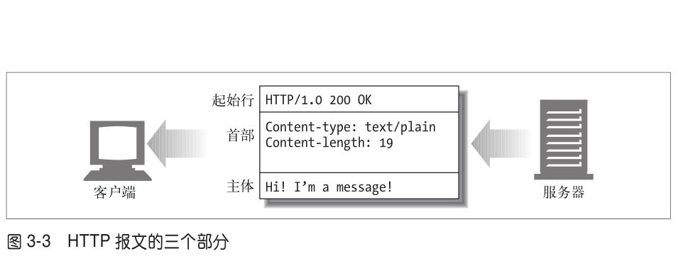

# 第 3 章 -- HTTP 报文
> 目录 (Table of Content)
- 3.1 报文流
    + 3.1.1 报文流入源端服务器 
    + 3.1.2 报文向下游流动
- 3.2 报文的组成部分
    + 3.2.1 报文的语法
    + 3.2.2 起始行
    + 3.2.3 首部
    + 3.2.4 实体的柱体部分
    + 3.2.5 版本 0.9 的报文
- 3.3 方法
    + 3.3.1 安全方法 
    + 3.3.2 GET
    + 3.3.3 HEAD
    + 3.3.4 PUT
    + 3.3.5 POST
    + 3.3.6 TRACE
    + 3.3.7 OPTIONS
    + 3.3.8 DELETE
    + 3.3.9 扩展方法
- 3.4 状态码
    + 3.4.1 100 ~ 199 -- 信息性 状态码 
    + 3.4.2 200 ~ 299 -- 成功状态码
    + 3.4.3 300 ~ 399 -- 重定向状态码
    + 3.4.4 400 ~ 499 -- 客户端错误状态码
    + 3.4.5 500 ~ 599 -- 服务器错误状态码
- 3.5 首部
    + 3.5.1 通用首部 
    + 3.5.2 请求首部
    + 3.5.3 响应首部
    + 3.5.4 实体首部
- 3.6 更多信息

---

## 生词
- 

---

## 3.1 报文流
> HTTP 报文是在 HTTP 应用程序之间发送的数据块。这些数据块以一些文本形式的 **元信息(meta-**
  **information)**开头，这些信息描述了报文的内容及含义，后面跟着可选的数据部分。这些报文在客
  户端、服务器和代理之间流动。术语"流入"、"流出"、"上游" 及 "下游" 都是用来描述报文方向的。
### 3.1.1 报文流入源端服务器 
- HTTP 使用术语流入（inbound）和流出（outbound）来描述事务处理（transaction）的方向。
  报文流入源端服务器，工作完成之后，会流回用户的 Agent 代理中。
### 3.1.2 报文向下游流动

## 3.2 报文的组成部分
- 
- HTTP 报文是简单的格式化数据块。每条报文都包含一条来自客户端的请求，或者一条来自服务器的
  响应。它们由3个部分组成:
     + (1) 对报文进行描述的 **起始行**(start line)。
     + (2) 包含属性的 **首部**n(header)块。
     + (3) 以及可选的包含数据的 **主体** (body)部分。
### 3.2.1 报文的语法
> 所有的 HTTP 报文都可以分为2类:
+ 请求报文 (request message): 请求报文会向 web 服务器请求一个动作。
    - 请求报文的格式:
        + `<method><request-URL><version>`
            - 方法 (method): 客户端希望服务器对资源执行的动作。一个单独的词，
                比如 GET/HEAD/POST。
            - 请求 URL (request-URL)
            - 版本 (version): 报文所所使用的 HTTP 版本。
                - 看起来是这样的: HTTP/<major>.<minore>
                - 其中**主要版本号**(major)和**次要版本号**(minor)都是整数。
        - `<headers>`
        - `<entity-body>`
    - 示例:
    ```base
        # HTTP 请求报文中包含命令和URL
        GET /specials/saw-blade.gif HTTP/1.0
        Host: www.joes-hardware.com
    ```
+ 响应报文 (response message): 响应报文会将请求的结果返回给客户端。
    - 响应报文的格式:(注意，只有起始行的语法有所不同)
        +  `<version><status><reason-phrase>`
            - 状态吗 (status-code): 用来告诉客户端，发生了什么事情。
            - 原因短语 (reason-phrase): 数字状态码的可读版本，包含行终止序列之前的所有文本。
        + `<headers>`
            - 首部(header): 可以有零个或多个首部，每个首部都包含一个名字，后面跟着一个冒号（:），
                然后是一个可选的空格，接着是一个值，最后是一个CRLF。首部是由一个空行（CRLF）结束的，
                表示了首部列表的结束和实体主体部分的开始。有些HTTP版本，比如HTTP/1.1，要求有效的请求或
                响应报文中必须包含特定的首部。本章稍后会探讨各种HTTP首部。
        + `<entity-body>`
            - **实体的主体部分** (entity-body)
    - 示例:
    ```base
        # HTTP 响应报文中包含了事务的结果
        HTTP/1.0 200 OK
        Content-Type: image/gif
        Content-length: 8752
        图片
    ```
### 3.2.2 起始行
### 3.2.3 首部
### 3.2.4 实体的柱体部分
### 3.2.5 版本 0.9 的报文

## 3.3 方法
### 3.3.1 安全方法 
### 3.3.2 GET
### 3.3.3 HEAD
### 3.3.4 PUT
### 3.3.5 POST
### 3.3.6 TRACE
### 3.3.7 OPTIONS
### 3.3.8 DELETE
### 3.3.9 扩展方法

## 3.4 状态码
### 3.4.1 100 ~ 199 --信息性 状态码 
### 3.4.2 200 ~ 299 --成功状态码
### 3.4.3 300 ~ 399 --重定向状态码
### 3.4.4 400 ~ 499 --客户端错误状态码
### 3.4.5 500 ~ 599 --服务器错误状态码

## 3.5 首部
### 3.5.1 通用首部 
### 3.5.2 请求首部
### 3.5.3 响应首部
### 3.5.4 实体首部

## 3.6 更多信息
     
