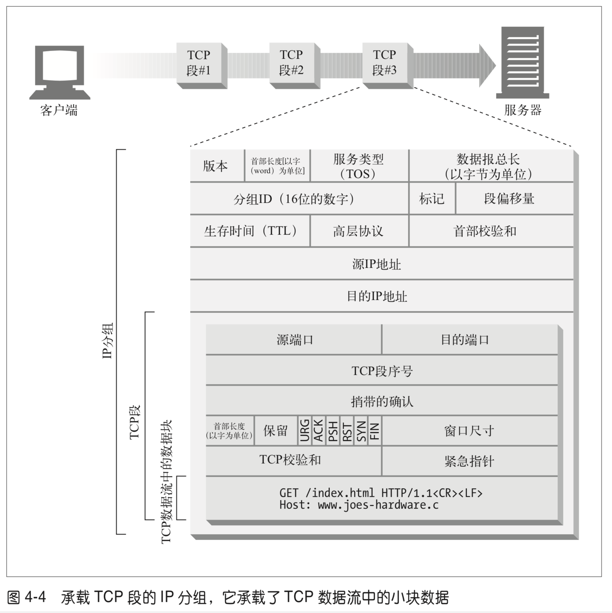

# 第 4 章 -- 连接管理
> 目录 Table of Content
- 4.1 TCP 连接
    + 4.1.1 TCP 的可靠数据管道
    + 4.1.2 TCP 流的分段的, 由 IP 分组传送
    + 4.1.3 保持 TCP 连接的正确运行
    + 4.1.4 用 TCP 套接字编程
- 4.2 对 TCP 性能的考虑
    + 4.2.1 HTTP 事务的时延
    + 4.2.2 性能聚焦区域
    + 4.2.3 TCP 连接的握手时延
    + 4.2.4 延迟确认
    + 4.2.5 TCP 慢启动
    + 4.2.6 Nagle 算法与 TCP_NODELAY
    + 4.2.7 TIME_WAIT 积累与端口耗尽
- 4.3 HTTP 连接的处理
    + 4.3.1 常被误解的 Connection 首部
    + 4.3.2 串行事务处理时延
- 4.4 并行连接
    + 4.4.1 并行连接可能会提高页面的加载速度 
    + 4.4.2 并行连接不一定更快
    + 4.4.3 并行连接可能让人 "感觉" 更快一些
- 4.5 持久连接
    + 4.5.1 持久以及并行连接
    + 4.5.2 HTTP/1.0 + keep-alive 连接
    + 4.5.3 Keep-Alive 操作
    + 4.5.4 keep-Alive 选项
    + 4.5.5 Keep-Alive 连接的限制和规则
    + 4.5.6 Keep-Alive 和 哑代理
        - (1) Connection 首部和盲中继
        - (2) 代理和遂跳首部
    + 4.5.7 插入 Proxy-Connection
    + 4.5.8 HTTP/1.1 持久连接
    + 4.5.9 持久连接的限制和规则
- 4.6 管道化连接
- 4.7 关闭连接的奥秘
    + 4.7.1 "任意"解除连接
    + 4.7.1 Content-Length 及截尾操作
    + 4.7.1 连接关闭容限, 重试以及幂等性
    + 4.7.1 正常关闭连接
- 4.8 更多信息
    + 4.8.1 HTTP 连接
    + 4.8.2 HTTP 性能问题
    + 4.8.3 TCP/IP
------

## 生词:
- pipeline ['paɪplaɪn] --n.管道；输油管

------

- 通过本章，可以了解到:
    + HTTP 是如何使用 TCP 链接的；
    + TCP 连接的延时、瓶颈以及存在的障碍；
    + HTTP 的优化，包括并行连接、keep-alive(持久连接) 和 管道化连接；
    + 管理连接时应该以及不应该做的事情。

## 4.1 TCP 连接
- 世界上几乎所有的 HTTP 通信都是由 TCP/IP 承载的，TCP/IP 是全球计算机及网络设备都在使用
  的一种常用的分组交换网络分层协议集。客户端应用程序可以打开一条 TCP/IP 连接，连接到可能
  运行在世界任何地方的服务器应用程序。一旦连接建立起来了，在客户端和服务器的计算机之间交换的
  报文就永远不会丢失、受损或失序。注(1)
### 4.1.1 TCP 的可靠数据管道
- HTTP 连接实际上就是 TCP 连接及其使用规则。TCP 连接是因特网上的可靠连接。想要正确、
  快速地发送数据，就需要了解 TCP 的一些基本知识。 TCP 为 HTTP 提供了一条 <可靠的
  比特(byte)传输管道>。从TCP 连接一端填入的字节会从另一端以原有的顺序、正确地传送出
  来。(参见图 4-2)
  
### 4.1.2 TCP 流是分段的, 由 IP 分组传送
- TCP 的数据是通过名为 IP 分组(或 IP 数据报)的小数据块来发送的。这样的话， 如图 4-3a
  所示，HTTP 就是 “HTTP over TCP over IP” 这个“协议栈”中的最顶层了。其安全版本
  HTTPS 就是在 HTTP 和 TCP 之间插入了一个(称为 TLS 或 SSL 的)密码加密层(图 4-3b)。
    + 
    + 
### 4.1.3 保持 TCP 连接的正确运行
+ 在任意时刻计算机都可以有几条 TCP 连接处于打开状态。TCP 是通过端口号来保持所有这些连接
  持续不断地运行。
    + IP 地址可以将你连接到正确的计算机，而端口号则可以将你连接到正确的应用程序上去。TCP 
      连接是通过 4 个值来识别的:
        - `< 源 IP 地址、源端口号、目的 IP 地址、目的端口号 >`
    + 这 4 个值一起唯一地定义了一条连接。两条不同的 TCP 连接不能拥有 4 个完全相同的地址
      组件值(但不同连接的部分组件可以拥有相同的值)。
### 4.1.4 用 TCP 套接字编程
+ 操作系统提供了一些操作其 TCP 连接的工具。我们来看一个 TCP 编程接口。 表 4-2 显示了
    套接字 API 提供的一些主要接口。 这个套接字(socket) API 向 HTTP 程序员隐藏了 
    TCP 和 IP 的所有细节。套接字 API 最初是为 Unix 操作系统发的，但现在几乎所有的
    操作系统和语言中都有其变体存在。
+ > 对比当前仓库根目录的这个文件查看: `/HTTP-Learning/IP-Socket-UDP.md` 
+ 表 4-2 对 TCP 连接进行编程所需的常见套接字接口函数
  ```javascript
    /** 套接字 API 调用 */
    s = socket(<parameters>)    // - 创建一个新的、未命名、未关联的套接字
    bind(s, <local IP:port>)    // - 向套接字赋一个本地端口号和接口
    connect(s, <remote IP:port>) // - 创建一条连接本地套接字与远程主机及端口的连接
    listen(s, ...)              // - 标识一个本地套接字，使其可以合法接受连接
    s2 = accept(s)              // - 等待某人建立一条到本地端口的连接
    n = read(s, buffer, n)      // - 尝试从套接字向缓冲区读取 n 个字节
    n = write(s, buffer, n)     // - 尝试从缓冲区中向套接字写入 n 个字节
    close(s)                    // - 完全关闭 TCP 连接
    shutdown(s, <side>)         // - 只关闭 TCP 连接的输入或输出端
    getsockopt(s, ...)          // - 读取某个内部套接字配置选项的值
    setsockopt(s, ...)          // - 修改某个内部套接字配置选项的值
  ```
+ 套接字 API 允许用户创建 TCP 的端点数据结构，将这些端点与远程服务器的 TCP端点进行连接，
    并对数据流进行读写。TCP API 隐藏了所有底层网络协议的握手细节，以及 TCP 数据流与
    IP 分组之间的分段和重装细节。
+ 下图的伪代码说明了可以怎样通过套接字 API 来凸显客户端和服务器在实现 HTTP 事务时所应执
    行的步骤。
+ 

## 4.2 对 TCP 性能的考虑
### 4.2.1 HTTP 事务的时延
### 4.2.2 性能聚焦区域
### 4.2.3 TCP 连接的握手时延
### 4.2.4 延迟确认
### 4.2.5 TCP 慢启动
### 4.2.6 Nagle 算法与 TCP_NODELAY
### 4.2.7 TIME_WAIT 积累与端口耗尽

## 4.3 HTTP 连接的处理
### 4.3.1 常被误解的 Connection 首部
### 4.3.2 串行事务处理时延

## 4.4 并行连接
### 4.4.1 并行连接可能会提高页面的加载速度 
### 4.4.2 并行连接不一定更快
### 4.4.3 并行连接可能让人 "感觉" 更快一些

## 4.5 持久连接
### 4.5.1 持久以及并行连接
### 4.5.2 HTTP/1.0 + keep-alive 连接
### 4.5.3 Keep-Alive 操作
### 4.5.4 keep-Alive 选项
### 4.5.5 Keep-Alive 连接的限制和规则
### 4.5.6 Keep-Alive 和 哑代理
        - (1) Connection 首部和盲中继
        - (2) 代理和遂跳首部
### 4.5.7 插入 Proxy-Connection
### 4.5.8 HTTP/1.1 持久连接
### 4.5.9 持久连接的限制和规则

## 4.6 管道化连接

## 4.7 关闭连接的奥秘
### 4.7.1 "任意"解除连接
### 4.7.1 Content-Length 及截尾操作
### 4.7.1 连接关闭容限, 重试以及幂等性
### 4.7.1 正常关闭连接

## 4.8 更多信息
### 4.8.1 HTTP 连接
### 4.8.2 HTTP 性能问题
### 4.8.3 TCP/IP


